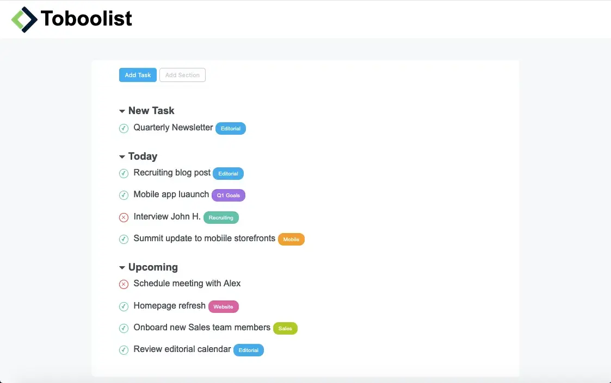

Quarto Esercizio Classe #137 - Boolean
===
Studente: Fabio Ferrero

---
# English

## Target of the project:
Replicate the web interface of a “ToDoList” using the basics of HTML and CSS, starting from a screenshot provided by the coach.

---
# Italiano

## Obiettivo del progetto:
Replicare l'interfaccia web di una "ToDoList" con l'uso delle basi di HTML e CSS, partendo da uno screenshot fornito dal coach.

---

---

---
<strong>Lo screenshot della pagina fornita dal coach è il seguente:</strong>

